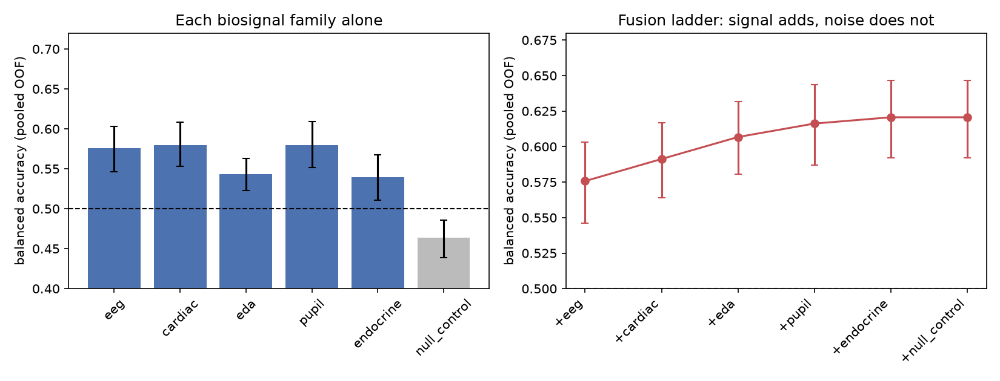

# Biosignal Decoding

Predicting human choice and behaviour from biosignals, and measuring the AIxBio
safety risk that this creates.

AIxBio Africa project. Aayush Gandhi and Gowthaam Gokulakrishnan.
Python package: `behavioral_decoding` (import path unchanged).

---

## What this is

Behaviour and decisions leave traces in the body: in the heart, the skin, the
pupil, the hormones, and the brain. Each trace can be picked up with cheap,
already-deployed hardware (a wrist strap, a phone camera, a saliva strip, a low-cost
EEG cap). On its own, each trace is a weak predictor. The safety question this
project studies is what happens when an AI system is given several of them at once.

The answer, demonstrated here, is that combining biosignal families recovers more
than the best single one. That turns a set of individually harmless-looking leaks
into a strong inference over protected behavioural and health attributes. An AI with
standing access to fused biosignal streams is, in effect, an inference engine over
the body, whatever its stated purpose. This is a biosecurity concern, and it is
sharpest for populations whose data is collected with the least protection.

This is **not** a neuroscience replication. The classic reward-anticipation
neuroforecasting result (Genevsky, Yoon and Knutson, 2017) is used here as **one
input** among several biosignal drivers of a decision, not as the thesis. The thesis
is the safety one above.

---

## The threat model

1. Cheap biosignal sensors are deployed first and most widely in the Global South.
2. Each sensor alone leaks a protected attribute only weakly.
3. An actor who reconciles several sensors, joined by identity, gets a strong
   inference (the inverse-variance argument in [the math](#the-math-why-fusion-helps)).
4. The inferred attributes (arousal, stress, risk bias, stigmatised illness) are
   exactly those useful for targeting, coercion, or discrimination.
5. Data collected locally is modelled elsewhere, where the fusion and the value
   accrue.

The defensive claim is not "do not sense biosignals." It is that **aggregate access
to multiple biosignal streams under one identity should be governed as a
capability**, because fusion converts individually-legal, individually-weak
collections into an inference no single collection consented to. Full argument and
Africa framing: [`docs/biosignal_fusion.md`](docs/biosignal_fusion.md) section 5.

---

## What the evidence shows

### 1. Fusion beats the best single family (mechanism, synthetic positive control)

Six biosignal families run through the framework's own ensemble on a generator with
planted, independent structure. Numbers from
[`results/biosignal_fusion.json`](results/biosignal_fusion.json), seed 0, nested
subject-grouped CV, 2000 subject-bootstraps:

| | balanced accuracy | 95% CI | ROC AUC |
|---|---|---|---|
| best single family (cardiac) | 0.580 | 0.55–0.61 | 0.605 |
| fusion, soft vote | 0.623 | 0.60–0.65 | 0.684 |
| fusion, accuracy-weighted | 0.621 | 0.59–0.65 | 0.682 |

The ablation ladder rises as each independent family joins and is flat when a
pure-noise family is appended (0.576 → 0.591 → 0.607 → 0.616 → 0.621 → **0.621**).
The noise family gets weight 0; the deliberately weak endocrine family fails its
permutation test (p = 0.26), as planted. This is a positive control for the
machinery, not a claim about any real person.



### 2. The single-family leak is already real on real data

| dataset | target | n | balanced accuracy | 95% CI | permutation |
|---|---|---|---|---|---|
| ds002989 delay-discounting bids | lowball this offer | 40 subjects | **0.882** | 0.861–0.902 | p = 0.001, valid |
| NARPS ds001734 gambles | accept or reject | 108 subjects | **0.814** | 0.790–0.836 | p = 0.001, valid |
| ASZED-153 EEG (Nigeria) | undisclosed diagnosis | 76 subjects | **0.705** | 0.616–0.799 | degenerate, see below |
| Kiva microloans (Kenya) | loan repayment | 3,023 loans | **0.631** | 0.615–0.646 | degenerate, see below |
| PPG-BP fingertip pulse | hypertension / diabetes / sex | 219 subjects | 0.580 / 0.542 / 0.528 | CIs touch or cross 0.5 | n/a |

Same pipeline, real publicly-licensed data, 443 people in total, including African
clinical EEG and Kenyan borrower records. Fusion (part 1) is the multiplier that
would turn these real single-channel leaks into a strong one.

**The two OpenNeuro arms are behaviour only.** An archive download of ds001734 and
ds002989 contains real `events.tsv` files but git-annex *pointer stubs* where the
BOLD volumes should be, so no imaging is used and no imaging claim is made. What is
real is the human decisions: 27,454 gambles and 4,134 bids. See
[`scripts/run_narps_behavior.py`](scripts/run_narps_behavior.py) and
[`scripts/run_delay_discounting.py`](scripts/run_delay_discounting.py).

**On the two degenerate permutation tests.** The label shuffle is done *within
subject*. Diagnosis never varies within a subject, and each Kiva loan is its own
group of one, so the null collapses onto the observed value and reports p = 1.0 by
construction. That is a tool/data mismatch, not evidence against the effect; the
subject-level bootstrap CIs are the valid statistic and both exclude chance. The two
behavioural arms above do not have this problem (labels vary within a person), and
their nulls sit where they should, at 0.536 and 0.500.

Details: [`docs/africa_neuroprivacy.md`](docs/africa_neuroprivacy.md),
[`docs/africa_cohort.md`](docs/africa_cohort.md),
[`docs/biosignal_privacy_generalization.md`](docs/biosignal_privacy_generalization.md).


### 3. What a further channel would buy (projection, calibrated)

No open cohort carries cardiac, facial, pupil and economic-choice data on the same
people, so the value of a *fourth* sensor cannot be measured here. It can be
projected: the combination rule proved in [`proofs/FusionMath.lean`](proofs/FusionMath.lean)
fixes the answer once the per-channel strengths are stated.
[`scripts/project_fusion_gain.py`](scripts/project_fusion_gain.py) maps balanced
accuracy to a discriminability that adds across independent channels, and reports a
band over the error correlation rho rather than one flattering number.

It is calibrated against a result we actually measured: from the five per-family
accuracies of the synthetic control it predicts 0.645 under independence, against a
measured 0.623, closest at rho = 0.2. That is the expected direction, because the
cardiac and EDA families were generated from one shared arousal driver.

| channels held, each worth 0.60 alone | independent | rho = 0.3 | rho = 0.5 |
|---|---|---|---|
| 2 | 0.640 | 0.623 | 0.615 |
| 4 | 0.694 | 0.643 | 0.626 |
| 5 | 0.714 | 0.649 | 0.628 |

The defensive reading: **independence between sensors, not sensor count, sets the
ceiling.** Heart rate, skin conductance, pupil and facial tone are all partly driven
by one arousal system, so stacking them buys less than a naive count suggests. It
still buys something, and the cheap-hardware argument survives.

---

## Methods: what each tests, why, and how we know it is the right technique

Every method below is a deliberate choice with a failure mode it prevents, and each
is the technique the literature identifies for this situation. Citations retrieved
from PubMed and the primary venues; DOIs link each one.

| Method | What it tests / does | Why this way (the failure it prevents) | Why it is the correct technique |
|---|---|---|---|
| **Subject-grouped nested CV** | Generalisation to *new people*, not new trials of known people | A random trial split puts the same person on both sides of a fold, so the model recognises the person, not the behaviour | Saeb et al. 2017 show record-wise CV gives strongly optimistic estimates versus subject-wise CV on wearable data ([10.1093/gigascience/gix019](https://doi.org/10.1093/gigascience/gix019)) |
| **In-fold SMOTE inside bagging** | Minority-class recovery under imbalance, without leakage | Oversampling before the split leaks synthetic neighbours across train/test and inflates scores | SMOTE itself: Chawla et al. 2002 ([10.1613/jair.953](https://doi.org/10.1613/jair.953)); the resample-inside-CV rule and the bias of doing it wrong: Sci Rep 2024 ([10.1038/s41598-024-62585-z](https://doi.org/10.1038/s41598-024-62585-z)) |
| **Bagging** | Variance reduction over a single unstable learner | One model over-fits its sample; one SMOTE draw dominates | Breiman 1996 ([10.1007/BF00058655](https://doi.org/10.1007/BF00058655)) |
| **Riemannian tangent-space classifier (EEG)** | Discriminative structure in inter-channel covariance | Covariance matrices live on the curved SPD manifold; z-scoring their raw entries is not geometrically valid | Barachant et al. 2012 introduce tangent-space classification of EEG covariance ([10.1109/TBME.2011.2172210](https://doi.org/10.1109/TBME.2011.2172210)); reviewed as state of the art by Yger, Berar & Lotte 2017 ([10.1109/TNSRE.2016.2627016](https://doi.org/10.1109/TNSRE.2016.2627016)); log-Euclidean metric: Arsigny et al. 2006 ([10.1002/mrm.20965](https://doi.org/10.1002/mrm.20965)) |
| **Balanced accuracy + majority baseline** | Skill above the majority-class rate | Plain accuracy looks high for a biased classifier on imbalanced data | Brodersen et al. 2010 ([10.1109/ICPR.2010.764](https://doi.org/10.1109/ICPR.2010.764)) |
| **Label-permutation test** | Whether any real class structure was found | A good-looking score can arise by chance on small samples | Ojala & Garriga 2010, JMLR 11:1833–1863 ([ACM](https://dl.acm.org/doi/10.5555/1756006.1859913)) |
| **Subject-level bootstrap CI** | An honest interval under clustered data | A trial-level interval on a dozen subjects is roughly three times too narrow | Resample the subjects, not the trials (grouped bootstrap) |
| **Inverse-variance / OOF-weighted reconciliation** | Whether fusing families beats the best one | Weighting by training accuracy rewards the worst over-fitter; equal weight wastes precision | Optimal linear combination of independent estimators; **proved in Lean/Mathlib** ([`proofs/FusionMath.lean`](proofs/FusionMath.lean)) and validated empirically ([`tests/test_fusion_math.py`](tests/test_fusion_math.py)) |

The biosignal-to-behaviour links each family relies on are themselves literature
grounded: cardiac/HRV (Forte et al. 2021,
[10.3390/brainsci11020243](https://doi.org/10.3390/brainsci11020243)), electrodermal
somatic marking (Dunn et al. 2006,
[10.1016/j.neubiorev.2005.07.001](https://doi.org/10.1016/j.neubiorev.2005.07.001)),
pupil/locus-coeruleus (Pajkossy et al. 2017,
[10.1111/psyp.12964](https://doi.org/10.1111/psyp.12964); Vincent et al. 2019,
[10.1371/journal.pcbi.1007126](https://doi.org/10.1371/journal.pcbi.1007126)),
endocrine risk bias (Coates & Herbert 2008,
[10.1073/pnas.0704025105](https://doi.org/10.1073/pnas.0704025105); Cueva et al.
2015, [10.1038/srep11206](https://doi.org/10.1038/srep11206)), and respiration
(Zelano et al. 2016,
[10.1523/JNEUROSCI.2586-16.2016](https://doi.org/10.1523/JNEUROSCI.2586-16.2016)).
The neuroforecasting component: Genevsky, Yoon & Knutson 2017
([10.1523/JNEUROSCI.1633-16.2017](https://doi.org/10.1523/JNEUROSCI.1633-16.2017)).

*Method and biosignal citations above were retrieved from PubMed and the primary
publication venues.*

### The math (why fusion helps)

Each family gives a noisy read of the same decision signal: `s_m = ℓ + ε_m`. If the
errors are independent, the inverse-variance combination has variance

    σ²_fused = 1 / Σ_m (1/σ_m²)  ≤  min_m σ_m²

so the fused estimate beats the best single family whenever more than one family
carries real, independent signal. This inequality is proved formally in Lean 4 /
Mathlib ([`proofs/FusionMath.lean`](proofs/FusionMath.lean), `lake build` exits 0,
no `sorry`) and checked three ways empirically, including a correlated-noise
negative control that confirms the gain vanishes without independence
([`tests/test_fusion_math.py`](tests/test_fusion_math.py)).

---

## Quick start

```bash
git clone https://github.com/aaygan29/behavioral_decoding.git
cd behavioral_decoding
pip install -e ".[dev]"

python scripts/run_demo.py --quick             # end-to-end on synthetic data
python scripts/run_biosignal_fusion.py --quick # the fusion experiment + gates
python scripts/project_fusion_gain.py --validate   # projection + its calibration check

# real behavioural cohorts (events only; no imaging needed)
python scripts/run_narps_behavior.py --root data/raw/narps_events
python scripts/run_delay_discounting.py --root data/raw/ds002989
```

The fusion script prints the per-family baselines, the fused result, the ablation
ladder, and five runtime gates that verify the planted facts; it exits non-zero if
any gate fails.

Optional extras, installed only when needed:

```bash
pip install -e ".[fmri]"     # nilearn, nibabel:    fMRI loading + ROI extraction
pip install -e ".[eeg]"      # mne:                 EEG loading
pip install -e ".[riemann]"  # pyriemann:           affine-invariant EEG backend
pip install -e ".[face]"     # opencv-python:       action-unit / landmark features
pip install -e ".[vision]"   # torch, transformers: the real ViT face encoder
```

---

## How the pipeline is built

One model per biosignal family, then reconciled:

```
per family:  BaggingClassifier( Pipeline( [tangent map for EEG] → scaler → in-fold SMOTE → learner ) )
reconcile:   majority  |  soft mean  |  accuracy-weighted (weights from out-of-fold skill, below-chance dropped)
evaluate:    nested subject-grouped CV → balanced accuracy, ROC AUC, Brier/ECE, bootstrap CI, permutation p
```

Adding a biosignal is adding a data block; the ensemble discovers families from the
data, so the mathematics does not change from one modality to the next. Two leaks
that both produce better-looking numbers and neither raises an error, subject
leakage and resampling leakage, are enforced in code and checked in CI rather than
left to memory (`tests/test_leakage.py`). Full design rationale, including the
rejected alternatives, is in [`docs/design.md`](docs/design.md) and
[`docs/estimators.md`](docs/estimators.md).

---

## Usage

```python
from behavioral_decoding.config import ExperimentConfig
from behavioral_decoding.features.align import build_dataset
from behavioral_decoding.io import BehaviorLoader, EEGLoader, FMRILoader
from behavioral_decoding.pipelines.train import run_experiment

blocks = {
    "eeg": EEGLoader().load(raw_paths, subject_ids),
    "behavior": BehaviorLoader().load(table, outcome_column="choice"),
    # cardiac / eda / pupil / endocrine blocks slot in the same way
}
dataset = build_dataset(blocks, y_individual={(subject, stimulus): choice, ...})
record = run_experiment(dataset, ExperimentConfig.load("configs/experiment_default.yaml"))
```

`run_experiment` writes a JSON run record with the resolved config, git commit and
dirty flag, per-family provenance, both evaluation levels, bootstrap intervals,
permutation p-values, calibration curves, and the final weights. A result whose
configuration is not recorded cannot be reproduced.

---

## Layout

```
src/behavioral_decoding/
├── io/          one loader per biosignal family + the ModalityBlock contract
├── features/    encoding and cross-family alignment
├── balance/     SMOTE variants, adaptive resampling, strategy selection
├── models/      bagged per-family learners, Riemannian tangent-space backend, ensemble
├── evaluation/  grouped CV, metrics + calibration, aggregate forecasting
├── pipelines/   end-to-end run and run-record writing
└── synthetic.py ground-truth generator (the positive control)

scripts/         run_biosignal_fusion.py, run_biosignal_privacy.py, run_africa_*.py, run_demo.py
proofs/          FusionMath.lean (Lean/Mathlib proof of the fusion inequality)
tests/           leakage, calibration, Riemann, fusion-math, and per-loader tests
docs/            see docs/README.md for the grouped index
```

---

## Development

```bash
pytest                          # full suite
pytest tests/test_fusion_math.py -q     # the fusion-math validation
pytest tests/test_leakage.py -v         # the leakage guards
ruff check src tests scripts
```

---

## Honest limits

- The fusion result is a **synthetic positive control**. It proves the machinery
  recovers a real aggregation gain and discards noise; it is not evidence that any
  real person's biosignals were fused at these levels. A licensed multimodal cohort
  (DEAP, WESAD) is the next step; the DEAP loader is already written for it.
- Shallow, hand-built features set a **floor, not a ceiling**: a null result does not
  bound what a well-resourced actor could extract.
- Small n on the real arms (76 EEG subjects, 14 Kiva sectors) supports pooled
  out-of-fold estimates with bootstrap intervals, not fine claims about which band or
  feature carries the signal.
- Governance snapshots in the Africa docs are dated and sourced, and flagged to
  re-check before external use.

---

## Ethics and scope

All datasets are public and appropriately licensed, cited where used. The project is
a defensive safety demonstration: it measures a leak that already exists in order to
argue for governing it, and it says plainly what it does and does not show.
